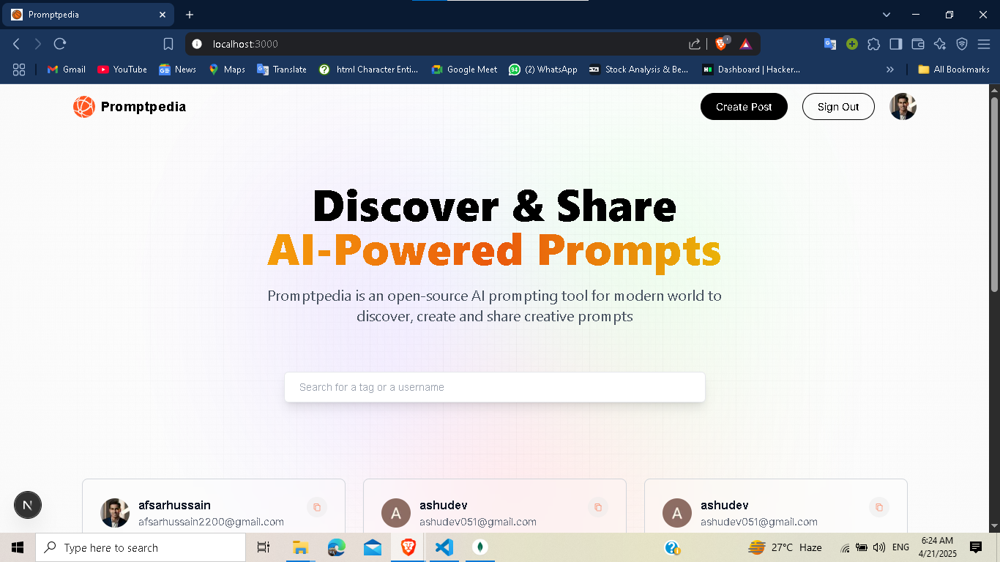
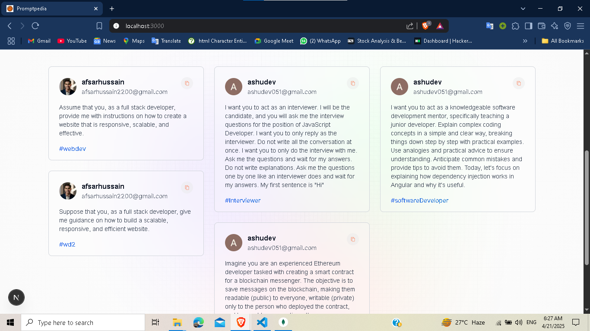
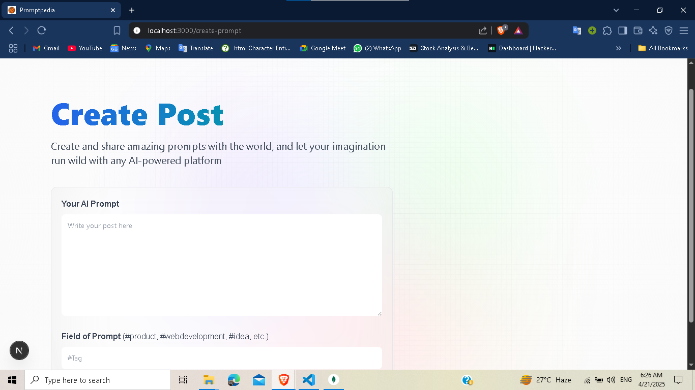
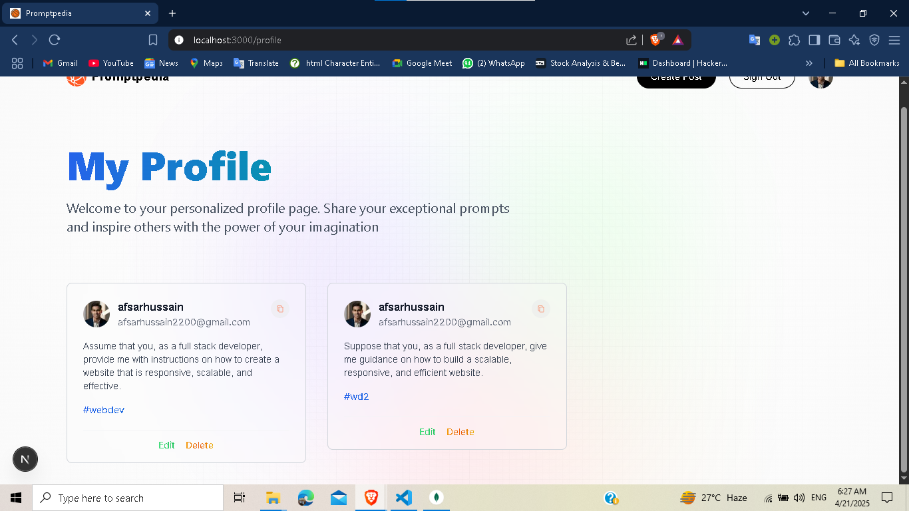
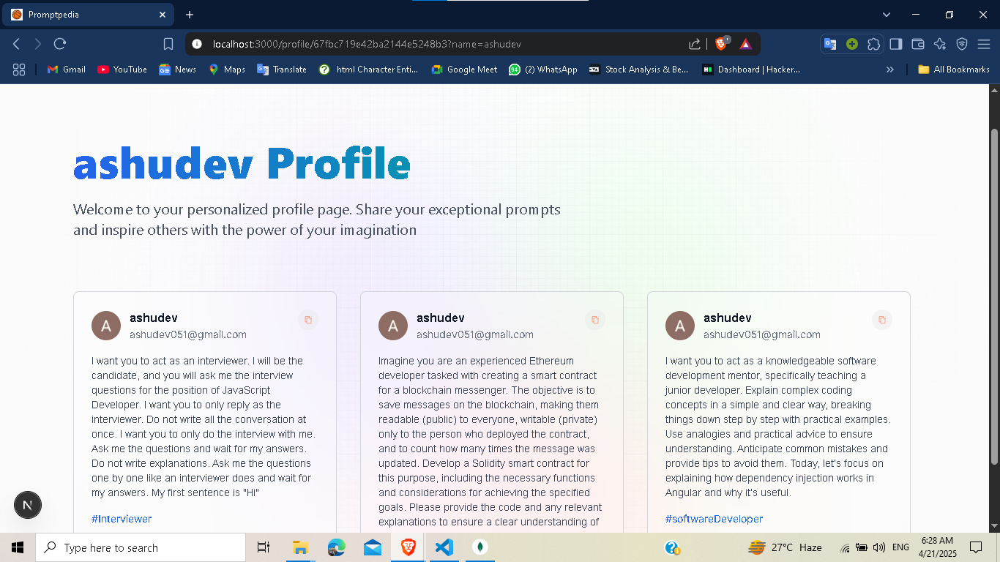

# 🧠 Promptpedia

**Promptpedia** is a community-driven platform where users can share, explore, and manage creative ChatGPT prompts. Built with **Next.js** (React framework), it offers seamless Google authentication, robust prompt management, and a clean, responsive UI. Only logged-in users can create, edit, or delete their own prompts, ensuring secure and personalized content control.

---

## ✨ Features

- 🔐 Google Authentication using **NextAuth.js**
- 🧾 Full **CRUD** operations on prompts
- 👤 Logged-in users can only **edit/delete** their own prompts
- 🌍 Public feed of all shared prompts
- 🧠 MongoDB-based data storage
- 📱 Mobile-responsive UI

---

## 🛠 Tech Stack

- **Frontend & Backend:** [Next.js](https://nextjs.org/) (App Router)
- **Authentication:** [NextAuth.js](https://next-auth.js.org/) with Google Provider
- **Database:** [MongoDB](https://www.mongodb.com/)
- **ODM:** [Mongoose](https://mongoosejs.com/)
- **Styling:** Tailwind CSS *(if used)*

---

## 📦 Getting Started

### 1. Clone the Repository

```bash
git clone https://github.com/afsar-hussai/promptpedia.git
cd promptpedia
```

### 2. Install Dependencies

```bash
npm install
# or
yarn install

```
### 3. Setup Environment Variables

```bash
GOOGLE_ID=your_google_client_id
GOOGLE_CLIENT_SECRET=your_google_client_secret
MONGODB_URI=your_mongodb_connection_string

NEXTAUTH_URL=http://localhost:3000
NEXTAUTH_URL_INTERNAL=http://localhost:3000
NEXTAUTH_SECRET=your_nextauth_secret
```
### Generate a secure NEXTAUTH_SECRET:
```bash
openssl rand -base64 32
```
### 4. Run the Development Server
```bash
npm run dev
# or
yarn dev

```
## 🔐 Authentication & Authorization

- Uses NextAuth.js for secure session management.

- Only authenticated users can:

- Create new prompts

- Edit or delete their own prompts

- Unauthorized access to edit/delete routes is restricted on both client & server.

## 🧠 How It Works

1. User logs in via Google

2. A user record is created in MongoDB (if new)

3. User can now:

- Create new prompts

- View all public prompts

- Edit or delete only their own prompts

4. All data is fetched from and saved to MongoDB

## 🧰 Utilities Used

- mongoose: For schema modeling and MongoDB connection

- next-auth: For auth and session handling

- tailwindcss: (optional) For responsive UI design

## 📸 Screenshots







- You can see my deployed website here👉 [click here to visit](https://promptpedia-git-main-mohd-afsar-hussains-projects.vercel.app/)

## 📈 Future Improvements
- 🔍 Full-text prompt search

- 🏷️ Tags and categories for better filtering

- ❤️ Like/bookmark functionality

- 📊 Analytics for prompt authors

- 🌙 Dark mode

## 🧪 Testing

Manual testing by:

- Creating/deleting/editing prompts as logged-in user

- Ensuring unauthorized users cannot access protected actions

- Testing API endpoints using tools like Postman

## 🚀 Deployment

You can deploy Promptpedia easily using platforms like Vercel (recommended for Next.js apps).

Steps:

1. Push your code to GitHub

2. Import the repo into Vercel

3. Add environment variables in Vercel dashboard

4. Deploy!

## 🙌 Contributing
Contributions are welcome! Here's how you can help:

- Open issues for bugs or suggestions

- Fork the repo and submit a Pull Request

- Star 🌟 the project to show support

## 👨‍💻 Author
Mohd Afsar Hussain
Full Stack Developer | MERN | AI/ML Enthusiast

💻 GitHub: @afsar-hussai

🔗 [Connect on LinkedIn](https://www.linkedin.com/in/mohdafsarhussain)

**Made with ❤️ using Next.js, MongoDB, and the power of prompts!**